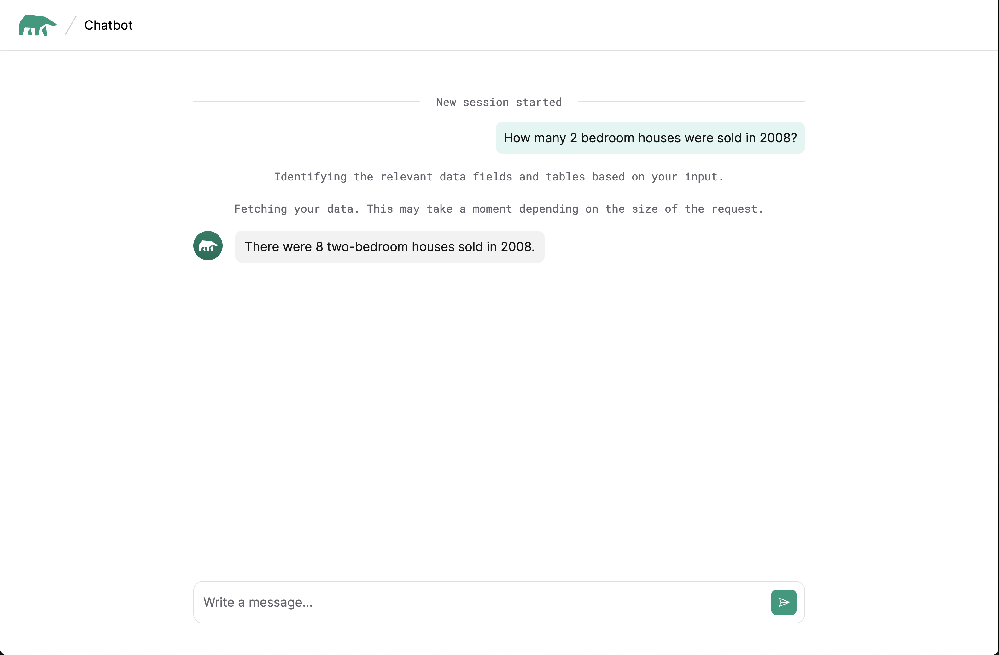

# Database-Mind Quickstart
Get started with the Minds Endpoint api’s. Minds Endpoint is designed to help AI agents accomplish tasks, accelerating development by connecting any Mind or LLM to your data source with minimal code. In this example, a Database Mind is a preconfigured AI system designed to simplify data access and answer questions in plain English directly from a PostgreSQL-compatible database. It supports popular databases such as: MySQL, PostgreSQL, Snowflake, Google BigQuery, MariaDB, and ClickHouse. Learn more in [documentation](https://docs.mdb.ai/docs/minds)


## Installation:
To run this project, you'll need Python 3 installed on your system. 

Clone this repository to your local machine using: 

``` git clone git@github.com:mindsdb/database-mind-quickstart.git ```

``` cd database-mind-quickstart/ ```

Create a virtual environment, execute the following command: 

``` python3 -m venv .venv ``` 

Activate the virtual environment by running: 

``` source .venv/bin/activate ``` 

Install dependencies using pip: 

``` pip3 install -r requirements.txt ``` 

## Configuration:

Go to https://mdb.ai/ register and login for generating a MindsDB API key.

Create an .env file and add your MindsDB API KEY:

``` MINDSDB_API_KEY=your_api_key ```

Add your database credentials to the .env file:

``` 
DATABASE_USER=database_user
DATABASE_PASSWORD=database_password
DATABASE_HOST=database_host
DATABASE_PORT=database_port
DATABASE_DATABASE=database_name
DATABASE_SCHEMA=database_schema
```

(Optional) If you don't have your own database, you can use our sample database by using these values in your `.env` file:

```
DATABASE_USER=demo_user
DATABASE_PASSWORD=demo_password
DATABASE_HOST=samples.mindsdb.com
DATABASE_PORT=5432
DATABASE_DATABASE=demo
DATABASE_SCHEMA=demo_data
```

## Running:
To run the project, execute the following command: 
``` python3 app.py ```

## Usage:
In your browser go to 
``` http://localhost:8000/ ```

If you connected to our sample database you can ask questions about the different tables we provide. You can see a small preview of the tables [here](https://docs.mdb.ai/docs/sample-database#sample-data-tables)

